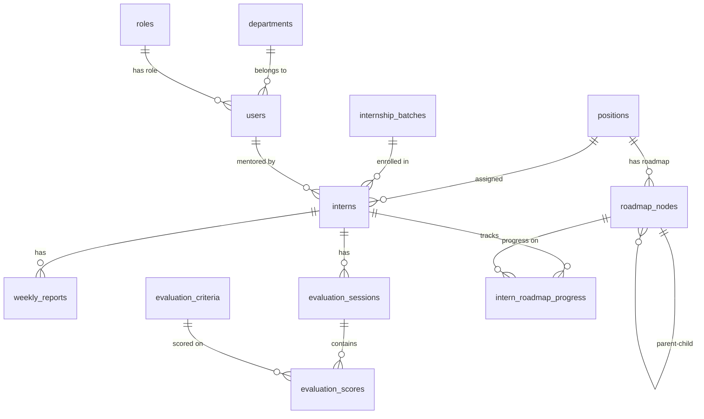

# InternHub — Developer Onboarding Guide

Welcome to **InternHub** (`manage_intern`), a full-stack internship management platform. This guide is written for new developers joining the project.

---

## Table of Contents

1. [What This System Does](#1-what-this-system-does)
2. [Tech Stack](#2-tech-stack)
3. [Repository Layout](#3-repository-layout)
4. [Local Development Setup](#4-local-development-setup)
5. [Architecture Overview](#5-architecture-overview)
6. [Authentication & Security](#6-authentication--security)
7. [Backend Guide](#7-backend-guide)
8. [Frontend Guide](#8-frontend-guide)
9. [Database & Migrations](#9-database--migrations)
10. [Domain Model & Business Flows](#10-domain-model--business-flows)
11. [AI Roadmap Module](#11-ai-roadmap-module)
12. [API Reference Summary](#12-api-reference-summary)
13. [Common Development Tasks](#13-common-development-tasks)
14. [Known Gaps & Caveats](#14-known-gaps--caveats)

---

## 1. What This System Does

InternHub centralizes internship operations inside an organization:

| Role | Primary responsibilities |
|------|------------------------|
| **Admin** | Dashboard, mentors, HR staff, interns, departments, positions, batches, evaluation criteria, evaluation sessions, roadmaps |
| **Mentor** | Dashboard, assigned interns, weekly reports, evaluation sessions, batches (read), profile |
| **HR** (partial) | HR user management in UI; limited backend permissions (bulk intern ops only) |

Core capabilities:

- Track interns through their lifecycle (active → warning → completed/dropped)
- Organize interns by department, position, and internship batch
- Weekly mentor reports with criteria-based scoring
- Formal evaluation sessions (first term, mid-term, final)
- AI-assisted learning roadmap generation per job position
- Dashboard analytics (trends, completion rates, mentor statistics)

---

## 2. Tech Stack

| Layer | Technology |
|-------|------------|
| Backend | Java 21, Spring Boot 3.3.5, Gradle |
| Frontend | Vue 3, Vite 7, Vue Router, Pinia |
| UI | Element Plus |
| Database | MySQL 8.0 |
| ORM | Spring Data JPA / Hibernate (`ddl-auto: none`) |
| Auth | JWT (OAuth2 Resource Server) + HTTP-only cookies |
| Mapping | MapStruct + Lombok |
| API docs | SpringDoc OpenAPI (Swagger UI) |
| AI | Spring AI 1.1.2 + Google Gemini (OpenAI-compatible API) |

---

## 3. Repository Layout

```
manage_intern/
├── backend/                    # Spring Boot API
│   ├── db.sql                  # Full database bootstrap script
│   ├── ddl/                    # Manual incremental migrations (V1–V8)
│   ├── ddl_data/
│   │   └── sample_data.sql     # Dev seed data (mentors, batches, interns)
│   └── src/main/java/com/rikai/backend/
│       ├── controller/         # REST endpoints
│       ├── service/            # Business logic (I*Service + impl)
│       ├── repository/         # Spring Data JPA
│       ├── model/              # JPA entities + enums
│       ├── dto/                # Request/response DTOs
│       ├── mapper/             # MapStruct mappers
│       ├── security/           # JWT, CORS, SecurityFilterChain
│       ├── ai/                 # AI roadmap generation
│       ├── event/              # Spring ApplicationEvents
│       ├── config/             # App init, async, OpenAPI
│       └── common/             # ApiResponse, ErrorCode, SuccessCode
├── frontend/                   # Vue 3 SPA
│   └── src/
│       ├── views/              # Page components
│       ├── components/         # Reusable UI (layout, dashboard, forms)
│       ├── layouts/            # AdminLayout, MentorLayout
│       ├── api/                # Axios domain modules
│       ├── composables/        # Shared Vue logic
│       ├── stores/             # Pinia stores (auth, toast)
│       ├── routers/            # Routes + auth guards
│       ├── locales/            # Custom i18n store
│       ├── constants/          # en.json, jp.json translations
│       └── types/              # JSDoc DTO typedefs
└── docs/
    └── DEVELOPER_GUIDE.md      # This file
```

---

## 4. Local Development Setup

### 4.1 Prerequisites

- Java 21
- Node.js 18+ and npm
- MySQL 8.0
- Git
- (Optional) Google Gemini API key for AI roadmap features

### 4.2 Database

```bash
# Create schema from scratch
mysql -u root -p < backend/db.sql

# Apply incremental migrations in order (if db.sql is not fully up to date)
# Run each file in backend/ddl/ manually: V2 through V8

# Load sample data (requires departments/positions from db.sql first)
mysql -u root -p intern_hub_db < backend/ddl_data/sample_data.sql
```

Default database name: `intern_hub_db`

Sample mentor password (bcrypt hash in seed data): `Abc123456@`

### 4.3 Backend Environment

```bash
cd backend
cp .env.example .env
```

Edit `backend/.env`:

| Variable | Description | Example |
|----------|-------------|---------|
| `URL_DATABASE` | JDBC connection string | `jdbc:mysql://localhost:3306/intern_hub_db` |
| `DB_USERNAME` | MySQL user | `root` |
| `DB_PASSWORD` | MySQL password | `root` |
| `SIGNER_KEY` | JWT signing secret (long random string) | `your-secure-random-string` |
| `ADMIN_EMAIL` | Auto-created admin account email | `admin@example.com` |
| `ADMIN_PASSWORD` | Auto-created admin password | `your-secure-password` |
| `GEMINI_API_KEY` | Google Gemini API key (for AI) | `AIza...` |

Start the backend:

```bash
cd backend
./gradlew bootRun
```

- API base: `http://localhost:8080`
- Swagger UI: `http://localhost:8080/swagger-ui/index.html`

On first startup, `ApplicationInitConfig` seeds `ADMIN` and `MENTOR` roles and creates the admin user from env vars.

### 4.4 Frontend Environment

```bash
cd frontend
cp .env.example .env
```

Edit `frontend/.env`:

```
VITE_API_URL=http://localhost:8080
```

Start the frontend:

```bash
cd frontend
npm install
npm run dev
```

- App URL: `http://localhost:5173`

---

## 5. Architecture Overview

```
┌─────────────────┐     HTTP (cookies + optional Bearer)     ┌─────────────────┐
│  Vue 3 SPA      │ ─────────────────────────────────────────► │  Spring Boot    │
│  (port 5173)    │ ◄───────────────────────────────────────── │  (port 8080)    │
└─────────────────┘     JSON ApiResponse<T>                  └────────┬────────┘
                                                                          │
                                                                          ▼
                                                                 ┌─────────────────┐
                                                                 │  MySQL 8        │
                                                                 │  intern_hub_db  │
                                                                 └─────────────────┘
```

**Request flow:**

1. User logs in via `POST /auth/login` → backend sets `ACCESS_TOKEN` and `REFRESH_TOKEN` cookies
2. Frontend stores user profile in `localStorage` (not the token)
3. Axios sends requests with `withCredentials: true` (cookies)
4. On 401, frontend calls `POST /auth/refresh` and retries the original request
5. All API responses use the `ApiResponse<T>` wrapper

**Response shape:**

```json
{
  "success": true,
  "message": "Login successful",
  "data": { ... },
  "timestamp": "2026-06-11T10:00:00Z",
  "statusCode": 200
}
```

Paginated lists typically nest items inside `data`:

```json
{
  "data": {
    "items": [...],
    "total": 42,
    "page": 0,
    "size": 10
  }
}
```

---

## 6. Authentication & Security

### JWT + Cookies

- Access token: `ACCESS_TOKEN` cookie (or `Authorization: Bearer` header)
- Refresh token: `REFRESH_TOKEN` cookie
- Token service persists refresh tokens in the `refresh_token` table

### Public endpoints (no auth)

- `/auth/**`
- `/swagger-ui/**`, `/v3/**`
- `/actuator/**`

All other endpoints require authentication.

### Role-based access

Controllers use `@PreAuthorize("hasAuthority('ADMIN')")` (and similar) for fine-grained control. Roles are embedded in the JWT as authorities.

### CORS

Configured in `SecurityConfig.java` to allow `http://localhost:5173` with credentials.

---

## 7. Backend Guide

### 7.1 Layered architecture

```
Controller → I*Service (interface) → *Service (impl) → Repository → Entity
                ↓
            Mapper (Entity ↔ DTO)
```

**Convention:** Controllers inject interfaces (`IInternService`), never concrete implementations.

### 7.2 Service packages

| Package | Domain |
|---------|--------|
| `auth/`, `token/` | Login, logout, JWT refresh |
| `user/` | Mentors, HRs, profile |
| `intern/` | Intern CRUD, status, bulk ops |
| `department/`, `position/` | Org structure |
| `internship_batch/` | Cohort management |
| `weeklyreport/` | Weekly mentor reports |
| `evaluationsession/` | Formal evaluations |
| `criteriagroup/`, `evaluationcriteria/`, `criteriascoredefinition/` | Scoring rubric |
| `dashboard/` | Charts and statistics |
| `ai/service/roadmap/` | AI roadmap generation |

### 7.3 Error handling

- `ErrorCode` enum maps business errors to HTTP status + message
- `GlobalExceptionHandler` converts exceptions to `ApiResponse` failures
- Validation uses Jakarta Bean Validation on request DTOs

### 7.4 Event system

Spring `ApplicationEvent` is used for dashboard activity tracking:

| Event | Published by |
|-------|-------------|
| `InternUpdatedEvent`, `InternDeletedEvent` | `InternService` |
| `WeeklyReportCreated/Updated/DeletedEvent` | `WeeklyReportService` |
| `EvaluationSessionCreated/Updated/DeletedEvent` | `EvaluationSessionService` |

`DashboardService` has `@EventListener @Async` handlers — currently stubs (no side effects yet).

### 7.5 Adding a new backend feature

1. Create/update JPA entity in `model/`
2. Add repository in `repository/`
3. Create request/response DTOs in `dto/`
4. Add MapStruct mapper in `mapper/`
5. Define `I*Service` interface + `*Service` implementation
6. Add controller with `@PreAuthorize` as needed
7. Add `ErrorCode` entries for new validation cases
8. Update `db.sql` and add a `ddl/V*.sql` migration if schema changes

---

## 8. Frontend Guide

### 8.1 Bootstrap

`main.js` registers Pinia, Vue Router, Element Plus, and global CSS. `App.vue` renders only `<RouterView />`.

### 8.2 Layout system

There is **no nested router layout**. Each view wraps itself:

- **Admin views** → `<AdminLayout>` (sidebar + header + slot)
- **Mentor views** → `<MentorLayout>`
- **Shared views** (intern detail, evaluation sessions, profile) pick layout dynamically:

```javascript
const LayoutComponent = computed(() =>
  authStore.userRole === 'MENTOR' ? MentorLayout : AdminLayout
)
```

### 8.3 Routing & guards

Routes in `routers/index.js`:

- `/admin/*` → `meta.role: "ADMIN"`
- `/mentor/*` → `meta.role: "MENTOR"`
- `router.beforeEach` checks `isAuthenticated` and redirects wrong roles to their dashboard

### 8.4 API layer

- `api/http.js` — Axios instance with 401 refresh queue
- Domain modules (`api/intern.js`, `api/user.js`, etc.) export named functions
- Views use composables for consistent UX:

| Composable | Purpose |
|------------|---------|
| `usePagination` | Page state (0-indexed `page` for backend) |
| `useLoading` | Loading spinners via `withLoading()` |
| `useApi` | Wraps API calls with success/error toasts |
| `useForm` | Reactive forms + Element Plus validation |
| `useDropdownData` | Pre-fetch departments, positions, mentors, batches |
| `useConfirm` | Delete/update confirmation dialogs |
| `useDateFormat` | Locale-aware date formatting |

### 8.5 Internationalization

Custom Pinia store (`locales/locale.js`), **not** `vue-i18n` (despite being in `package.json`).

- Strings in `constants/en.json` and `constants/jp.json`
- Usage: `const t = computed(() => localeStore.t)` then `t('sidebar.dashboard')`
- Locale persisted in `localStorage` key `locale`

### 8.6 Adding a new frontend page

1. Create view under `src/views/<feature>/`
2. Register route in `routers/index.js` with correct `meta.role`
3. Wrap in `AdminLayout` or `MentorLayout`
4. Add API functions in `src/api/<domain>.js`
5. Add translation keys to `en.json` and `jp.json`
6. Add sidebar link in `AdminSidebar.vue` or `MentorSidebar.vue`

### 8.7 Views by feature

| Area | Key views |
|------|-----------|
| Auth | `LoginView` |
| Dashboard | `AdminDashboardView`, `MentorDashboardView` |
| Interns | `InternListView`, `InternDetailView`, `InternEditView` |
| Users | `MentorListView`, `HRListView` |
| Mentor workspace | `MyInternListView`, `MyReportsListView` |
| Org config | `DepartmentTreeView`, `PositionTreeView` |
| Batches | `BatchListView`, `BatchDetailView` |
| Evaluation | `EvaluationCriteriaListView`, `EvaluationSession*` views |
| Roadmap | `RoadmapBuilderView`, `RoadmapListView`, `RoadmapDetailView` |
| Profile | `ProfileView` |

---

## 9. Database & Migrations

### Strategy

- **JPA does not manage schema** (`ddl-auto: none`)
- **`db.sql`** — canonical full schema for fresh installs
- **`ddl/V*.sql`** — manual incremental migrations (Flyway-style naming, no Flyway dependency)

### Recommended workflow

1. Run `db.sql` on a fresh MySQL instance
2. Apply `ddl/V2` through `V8` in order if needed
3. Load `ddl_data/sample_data.sql` for dev data

### Core tables

| Table | Purpose |
|-------|---------|
| `roles`, `users` | System users (admin, mentor, HR) |
| `departments`, `positions` | Organization structure |
| `internship_batches`, `interns` | Cohorts and intern records |
| `weekly_reports`, `weekly_report_details` | Mentor weekly evaluations |
| `criteria_groups`, `evaluation_criteria`, `criteria_score_definitions` | Scoring rubric |
| `evaluation_sessions`, `evaluation_scores` | Formal review sessions |
| `roadmap_nodes`, `intern_roadmap_progress`, `tags` | Learning roadmaps |
| `intern_status_history` | Status change audit trail |
| `refresh_token` | JWT refresh token storage |
| `spring_ai_chat_memory` | AI chat history (from V8 migration) |

### Entity relationship (simplified)



---

## 10. Domain Model & Business Flows

### Key enums

| Enum | Values | Used for |
|------|--------|----------|
| `RoleType` | ADMIN, MENTOR, HR | User roles |
| `InternStatus` | ACTIVE, WARNING, COMPLETED, DROPPED | Intern lifecycle |
| `OfferStatus` | NONE, PROPOSED, ACCEPTED, REJECTED | Job offer tracking |
| `BatchStatus` | ONGOING, CANCEL, COMPLETED | Batch state |
| `SessionType` | FIRST_TERM, MID_TERM, FINAL | Evaluation milestones |
| `EvaluationConclusion` | PASS, NEED_IMPROVEMENT, FAIL | Session outcome |
| `NodeType` | PHASE, MODULE, LESSON, TASK | Roadmap tree hierarchy |
| `ProgressStatus` | LOCKED, OPEN, IN_PROGRESS, SUBMITTED, COMPLETED, REJECTED | Per-node intern progress |

### Typical business flow

```
Admin sets up org structure
    → departments, positions, batches, evaluation criteria
Admin/Mentor creates interns
    → assigned to position, batch, mentor
Mentor submits weekly reports
    → criteria scores + comments per week
Evaluation sessions created (manual or generated)
    → first term → mid-term → final (sequential)
AI generates position roadmaps
    → chat → draft → confirm → saved to roadmap_nodes
Dashboard aggregates metrics
    → trends, completion rates, mentor workload
```

---

## 11. AI Roadmap Module

Location: `backend/src/main/java/com/rikai/backend/ai/`

### What it does

AI-assisted internship roadmap creation using Google Gemini via Spring AI:

1. User chats about desired roadmap (`POST /roadmaps/chat-process`)
2. `IntentRouterAgent` classifies intent (select position, set duration, edit, etc.)
3. `RoadmapGeneratorService` generates a hierarchical draft (PHASE → MODULE → LESSON → TASK)
4. Draft stored in memory (`DraftRoadmapManager`, 30-min TTL)
5. User confirms → saved to `roadmap_nodes` table

### Key classes

| Class | Role |
|-------|------|
| `AiConfig` | ChatClient beans (router + creator models) |
| `IntentRouterAgent` | LLM intent classification |
| `RoadmapEditorAgent` | Natural-language draft editing |
| `RoadmapGeneratorService` | Main orchestrator |
| `PromptManager` | System prompts and JSON schemas |
| `RoadmapToolsConfig` | DB lookup tools for positions |

### Model configuration (`application.yml`)

| Agent | Model | Temperature | Purpose |
|-------|-------|-------------|---------|
| Router | `gemini-2.5-pro` | 0.15 | Intent routing |
| Creator | `gemini-2.5-flash` | 0.7 | Roadmap generation/editing |

Requires `GEMINI_API_KEY` in backend `.env`.

### Frontend

- `RoadmapBuilderView` — chat + drag-drop tree builder
- `RoadmapListView` / `RoadmapDetailView` — browse saved roadmaps
- `RouteTesterView` — dev test page (no auth required)

---

## 12. API Reference Summary

Full interactive docs: `http://localhost:8080/swagger-ui/index.html`

### Controllers

| Controller | Base path | Primary consumers |
|------------|-----------|-------------------|
| `AuthController` | `/auth` | Login, refresh, logout |
| `UserController` | `/users` | Mentors, HRs, profile |
| `InternController` | `/interns` | Intern CRUD, filters, bulk ops |
| `DepartmentController` | `/departments` | Department CRUD |
| `PositionController` | `/positions` | Position CRUD |
| `InternshipBatchController` | `/internship-batches` | Batch CRUD |
| `WeeklyReportController` | `/weekly-reports` | Weekly mentor reports |
| `EvaluationSessionController` | `/evaluation-sessions` | Formal evaluations |
| `CriteriaGroupController` | `/criteria-groups` | Criteria grouping |
| `EvaluationCriteriaController` | `/evaluation-criteria` | Rubric management |
| `CriteriaScoreDefinitionController` | `/criteria-score-definitions` | Score label definitions |
| `DashboardController` | `/dashboard` | Charts and statistics |
| `RoadmapController` | `/roadmaps` | AI roadmap generation |

### Role access patterns

| Endpoint pattern | ADMIN | MENTOR | HR |
|------------------|-------|--------|-----|
| Org config (departments, positions, criteria) | Write | Read | — |
| Intern CRUD | Full | Own interns | Bulk ops only |
| Weekly reports | Full | Own reports | — |
| Evaluation sessions | Full | Own sessions | — |
| Dashboard | Admin charts | Mentor stats | — |
| Roadmaps | Full | Full | — |

---

## 13. Common Development Tasks

### Run tests

```bash
cd backend
./gradlew test
```

### Build for production

```bash
# Backend
cd backend && ./gradlew build

# Frontend
cd frontend && npm run build && npm run preview
```

### Add a new API endpoint

1. Backend: DTO → Service → Controller → test via Swagger
2. Frontend: `api/<domain>.js` function → use in view with `useApi`
3. Add route + view if user-facing

### Add a database column

1. Update entity in `model/`
2. Add SQL to `db.sql` and new `ddl/V9__*.sql`
3. Update DTOs, mapper, and service logic

### Debug auth issues

- Check cookies in browser DevTools (Application → Cookies)
- Verify `VITE_API_URL` matches backend URL
- Confirm CORS origin in `SecurityConfig` matches frontend port
- Check `SIGNER_KEY` is set and consistent across restarts

---

## 14. Known Gaps & Caveats

| Area | Note |
|------|------|
| HR role | Exists in DB and partial backend (`GET /users/hrs`, bulk intern ops), but no dedicated HR dashboard or broad API access |
| Event listeners | `DashboardService` event handlers are empty stubs |
| `InternCreatedEvent` | Defined but never published |
| `InternStatusChangedEvent` | Has listener but no publisher |
| Auth token in frontend | `http.js` references `authStore.accessToken` but store does not define it — session relies on cookies |
| `vue-i18n` | Listed in `package.json` but unused; custom Pinia locale store is used instead |
| `AuthLayout.vue` | Exists but no view uses it |
| Migrations | Manual SQL only — no Flyway/Liquibase automation |
| Duplicate enum | `com.rikai.backend.common.InternStatus` mirrors `model.Enum.InternStatus` |

---

## Quick Start Checklist

- [ ] Install Java 21, Node 18+, MySQL 8
- [ ] Run `backend/db.sql` to create database
- [ ] Copy and fill `backend/.env` and `frontend/.env`
- [ ] Start backend: `cd backend && ./gradlew bootRun`
- [ ] Start frontend: `cd frontend && npm install && npm run dev`
- [ ] Login at `http://localhost:5173/login` with admin credentials from `.env`
- [ ] Explore API at `http://localhost:8080/swagger-ui/index.html`
- [ ] (Optional) Load `backend/ddl_data/sample_data.sql` for richer test data

---

*Last updated: June 2026*
